# WRO2026-FE-UnemployedNerds

Repository of **Team UnemployedNerds** for the **2026 World Robot Olympiad (WRO) Future Engineers – Iran National Competition**.

---
# Table of Contents

- [The Team](#the-team)
  - [Araz Abbasi](#araz-abbasi)
  - [Radin Mirsarvestani](#radin-mirsarvestani)
  - [Benyamin Nikvarz](#benyamin-nikvarz)
  - [Golo (Team Mascot)](#golo)
  - [Team Photo](#our-team-photo)
  - [Fun Photo](#fun-photo)

- [Competition Overview](#quick-wro-future-engineers-challenge-overview)
  - [Open Challenge](#open-challenge)
  - [Obstacle Challenge](#obstacle-challenge)

- [Robot Gallery](#robot-photos)
  - [Front View](#front-view)
  - [Rear View](#rear-view)
  - [Left Side](#left-side)
  - [Right Side](#right-side)
  - [Top View](#top-view)
  - [Bottom View](#bottom-view)

- [Videos](#videos)
  - [Open Challenge Run](#open-challenge-run)
  - [Obstacle Challenge Run](#obstacle-challenge-run)
  - [Robot Explanation Video](#full-robot-explanation)

- [Platform and Components Used](#platform-and-components-used)
  - [Why We Chose the LEGO EV3 Brick](#why-we-chose-the-lego-ev3-brick)
  - [Components and Sensors](#components-and-sensors)
    - [EV3 Medium Motor](#lego-ev3-medium-motor)
    - [HiTechnic Compass Sensor](#hitechnic-compass-sensor)
    - [HiTechnic Color Sensor](#hitechnic-color-sensor)
    - [Pixy2 Vision Sensor](#pixy2-vision-sensor)
    - [LEGO EV3 Ultrasonic Sensor](#lego-ev3-ultrasonic-sensor)
    - [Why We Combine the Compass and Ultrasonic Sensors](#why-we-combine-the-compass-and-ultrasonic-sensors)

- [Robot Design](#robot)
  - [Mechanical Design](#robot-mechanical-design)
    - [Rear Wheel Drive Mechanism](#rear-wheel-drive-mechanism)
    - [Steering Mechanism](#steering-mechanism)
    - [Mobility Management](#mobility-management)
      - [Drivetrain Optimization](#1-drivetrain-optimization)
      - [Steering Precision](#2-steering-precision)
      - [Chassis Stability](#3-chassis-stability)

- [Robot Software](#robot-software-aspect)
  - [Development Platform](#development-platform)
  - [Libraries](#libraries)

- [Open Challenge Software](#open-challenge)
  - [Software Architecture](#open-challenge)
  - [Setup](#1-setup)
  - [Servo System](#2-servo-system)
    - [Rear Wheel Control](#rear-wheel-control)
    - [Steering Control](#steering-control)
    - [Complete Servo Module](#complete-servo-module)
  - [Open Challenge Management](#3-open-challenge-management)
    - [Initialization](#initialization)
    - [Clockwise (CW) and Counter-Clockwise (CCW) Modes](#clockwise-cw-and-counter-clockwise-ccw-modes)
    - [CCW Block](#ccw-block)
      - [Positioning the Ultrasonic Sensor](#stage-1--positioning-the-ultrasonic-sensor)
      - [Steering Decision](#stage-2--steering-decision)
      - [Motor Command](#stage-3--motor-command)
      - [Wall Following](#wall-following)
      - [Line Detection](#line-detection)

- [Obstacle Challenge Software](#obstacle-challenge-code)
  - [Setup](#1-setup-1)
  - [Servo System](#2-servo-1)
  - [Leaving the Parking Zone](#3-getting-out-of-the-parking-zone)
  - [Compass Initialization](#4-deciding-the-compass-numbers)
  - [CW and CCW Navigation](#5-ccw-and-cw-blocks)
  - [Obstacle Detection and Avoidance](#6-obstacle-management-strategy)
  - [Parking Procedure](#7-getting-into-the-parking-zone)

- [Future Improvements](#future-improvements)

- [Acknowledgements](#acknowledgements)
---

# The Team

## Araz Abbasi

- **Role:** Programmer
- **Age:** 15

Hello! I'm **Araz Abbasi** from Iran. This is my fifth year participating in the World Robot Olympiad. I have a strong passion for mathematics, physics, electronics, and programming. Outside of robotics, I enjoy playing chess and currently hold a **1500 FIDE Classical** rating.

- **Instagram:** araz.abbasi.3
- **Email:** arazabbasi830@gmail.com

---

## Radin Mirsarvestani

- **Role:** Mechanical Designer & Builder
- **Age:** 15

Hello! I'm **Radin Mirsarvestani** from Iran. This is also my fifth year competing in the World Robot Olympiad. I enjoy designing and building robots, and in my free time I like playing War Thunder.

- **Instagram:** Not Available
- **Email:** radin.mirsarvestani1030@gmail.com

---

## Benyamin Nikvarz

- **Role:** Coach
- **Age:** 20

I'm currently studying Electrical Engineering and have been involved in robotics since 2016. This is my second year coaching Team UnemployedNerds. Before becoming a coach, I also competed in the World Robot Olympiad, which allows me to share valuable experience with the team.

- **Instagram:**
- **Email:** benyamin.nikvarz@gmail.com

---

## Golo

- **Role:** Team Mascot
- **Age:** Unknown

Golo is the official mascot of Team UnemployedNerds and provides emotional support during long building and programming sessions.

- **Instagram:** golo_lovers
- **Email:** arazabbasi830@gmail.com

---

## Our Team Photo

---

## Fun Photo

---

# Quick WRO Future Engineers Challenge Overview

## Open Challenge

The objective of the Open Challenge is to complete **three autonomous laps** around the track without obstacles. The robot must demonstrate accurate wall-following, reliable line detection, and smooth navigation while maintaining consistent speed.

**Goal:** Successfully complete 3 laps.

---

## Obstacle Challenge

In the Obstacle Challenge, the robot must complete multiple autonomous laps while avoiding **green** and **red** pillars placed throughout the course. Green pillars must be passed on the **left**, while red pillars must be passed on the **right**. After completing the required laps, the robot must finish by parking inside the designated parking zone.

**Goal:** Complete all laps and perform a successful autonomous parallel parking maneuver.

## Robot Photos
- front

- back

- left

- right

- top

- bottom

## Videos 
- open challenge
(place vid here)

- obstacle challengee
(place vid here)

- YouTube Explanation Video  
https://www.youtube.com/watch?v=XXXX

# Robot Photos

Below are photographs of our robot from different angles to provide a complete overview of its mechanical design and construction.

### Front View

### Rear View

### Left Side

### Right Side

### Top View

### Bottom View

---

# Videos

### Open Challenge

*(Insert Open Challenge video here.)*

### Obstacle Challenge

*(Insert Obstacle Challenge video here.)*

### Full Robot Explanation

https://www.youtube.com/watch?v=XXXX

---

# Platform and Components Used

## Why We Chose the LEGO EV3 Brick

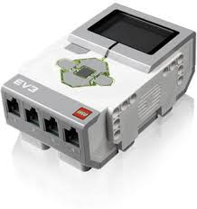

The LEGO Mindstorms EV3 Brick serves as the central controller of our robot. Although it is an older platform, we selected it because of its reliability, simplicity, and excellent compatibility with LEGO hardware and third-party sensors.

The EV3 allowed us to rapidly prototype, test, and improve our robot throughout the development process while maintaining a stable and dependable control system.

### Advantages

- Reliable and stable platform
- Easy integration with LEGO and third-party sensors
- Precise motor control
- Supports multiple programming languages
- Large robotics community with extensive documentation
- Fast development and debugging
- Built-in display, buttons, and speaker
- Expandable using external microcontrollers such as Arduino or Raspberry Pi Pico

### Disadvantages

- Limited processing power
- Only 64 MB of RAM
- Limited Flash storage
- No built-in Wi-Fi
- Limited number of sensor and motor ports
- Discontinued by LEGO
- Not suitable for advanced AI or computer vision applications

### Technical Specifications

The LEGO EV3 Brick features:

- ARM9 Processor
- 64 MB RAM
- 16 MB Flash Storage
- Linux-based Operating System
- USB and Bluetooth Connectivity
- Four Sensor Ports
- Four Motor Ports

Despite its hardware limitations, the EV3 provides everything required for reliable autonomous navigation in the WRO Future Engineers competition.

---

# Components and Sensors

## Motors

### LEGO EV3 Medium Motor

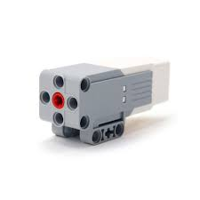

### Specifications

- **Type:** Medium DC Servo Motor
- **Operating Voltage:** 9 V
- **Maximum Speed:** 160 RPM
- **Maximum Torque:** 20 N·cm
- **Effective Torque Under Load:** Approximately 15 N·cm
- **Weight:** 120 g

### Purpose in Our Robot

We use three EV3 Medium Motors:

- Steering the front wheels
- Driving the rear differential
- Rotating the ultrasonic sensor during wall-following

The medium motor provides an excellent balance between speed and torque, making it more suitable than the large EV3 motor for our lightweight robot.

---

# Sensors and Modules

## HiTechnic Compass Sensor

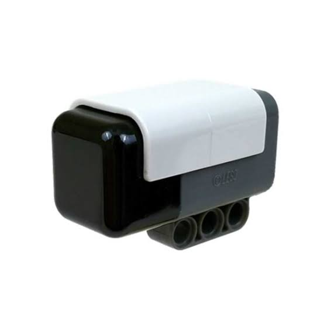

### Overview

The HiTechnic Compass Sensor is a digital compass designed for LEGO EV3 and NXT robots. It measures the Earth's magnetic field using an internal three-axis magnetometer, allowing the robot to determine its heading accurately.

### Operating Principle

The sensor continuously calculates the robot's heading and returns an angle between **0° and 359°**.

- **0°** → North
- **90°** → East
- **180°** → South
- **270°** → West

Unlike wheel encoders, the compass remains accurate even if wheel slippage occurs during turns.

### Advantages

- High heading accuracy
- Excellent long-term stability
- Real-time heading updates
- Compensates for wheel slip
- Easy integration with EV3

### Limitations

- Sensitive to nearby magnetic fields
- Can be affected by electric motors
- Measures magnetic north rather than true north

### Implementation

The compass sensor is mounted away from the drive motors to minimize magnetic interference. During autonomous operation, it continuously provides heading feedback, allowing our robot to perform accurate turns and maintain a stable driving direction.

### Why We Use It

The compass sensor enables the robot to maintain precise orientation throughout both challenges, even after collisions or wheel slip.

---

## HiTechnic Color Sensor

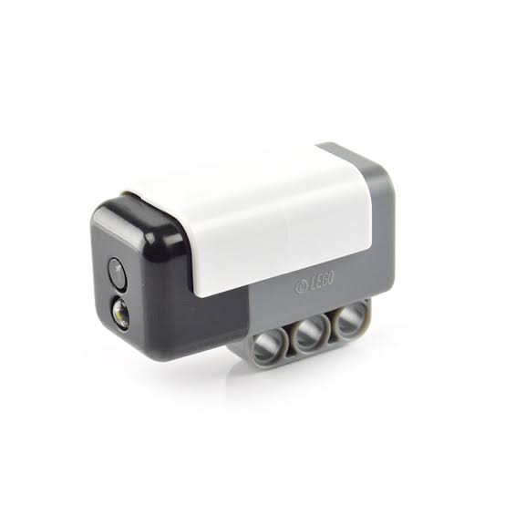

### Overview

The HiTechnic Color Sensor detects colors and reflected light intensity using integrated RGB LEDs and photodiodes. It is primarily responsible for detecting the blue and orange field markings used throughout the competition.

### Operating Principle

The sensor illuminates the surface with red, green, and blue light before measuring the reflected intensity. The measured values are then used to classify the detected color.

### Advantages

- Accurate color recognition
- Fast response time
- Measures reflected light intensity
- Easy integration with EV3

### Limitations

- Performance depends on lighting conditions
- Sensor accuracy varies with distance
- Reflective surfaces can affect readings
- Requires calibration before competition

### Implementation

The sensor is mounted close to the ground to maximize detection accuracy. It detects colored markers that indicate turning points and navigation events.

### Why We Use It

The color sensor reliably detects the blue and orange strips on the competition field, allowing the robot to determine when to perform turns and other navigation actions.
## Pixy2 Vision Sensor

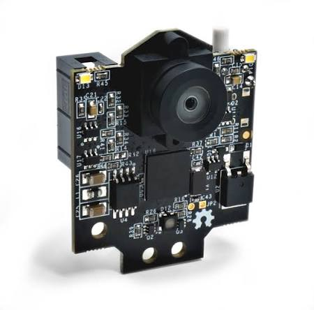

### Specifications

| **Property** | **Value** |
|--------------|-----------|
| Type | Smart Vision Sensor |
| Microcontroller | NXP LPC4330 (Dual-Core ARM Cortex-M4/M0) |
| Resolution | 1296 × 976 (processed internally at 640 × 480) |
| Frame Rate | Up to 60 FPS |
| Field of View | 80° Horizontal, 40° Vertical |
| Operating Voltage | 5 V |
| Current Consumption | 130–170 mA |
| Communication | Custom I2C (Port 4) |
| Color Signatures | Up to 7 programmable signatures |
| Features | Color Recognition, Object Tracking, Line Tracking, Barcode Detection |

### Overview

The Pixy2 Vision Sensor performs real-time image processing internally, allowing our robot to detect colored obstacles without placing additional computational load on the EV3 Brick. This enables fast and reliable obstacle detection while maintaining high driving speeds.

### Implementation

For the Obstacle Challenge, the Pixy2 detects:

- **Red Pillars** – Signature 1
- **Green Pillars** – Signature 2

The camera operates at up to **60 frames per second**, providing rapid detection and tracking of obstacles. Before making steering decisions, detected objects are filtered using their X and Y coordinates to eliminate false detections and improve reliability.

### Advantages

- High-speed image processing
- Up to 60 FPS
- Supports seven programmable color signatures
- Onboard image processing reduces EV3 CPU usage
- Supports line tracking and barcode recognition
- Easy integration using I2C

### Limitations

- Sensitive to lighting conditions
- Requires calibration using PixyMon
- Similar colors may occasionally produce false detections

### Lessons Learned

During development, we found that proper calibration using **PixyMon v2** significantly improved detection accuracy. Consistent lighting conditions also played an important role in achieving reliable obstacle recognition.

### Performance

During testing, the Pixy2 achieved approximately **97% detection accuracy**, resulting in smoother steering corrections, fewer collisions, and more consistent autonomous runs.

### Why We Chose Pixy2

We evaluated several vision solutions before selecting the Pixy2. It provided the best balance between speed, simplicity, and reliability for the EV3 platform.

Key advantages include:

- Built-in image processing
- Minimal CPU usage
- Low communication latency
- High frame rate (60 FPS)
- Reliable color tracking
- Compact and lightweight design
- Excellent compatibility with the EV3 platform

---

## LEGO EV3 Ultrasonic Sensor
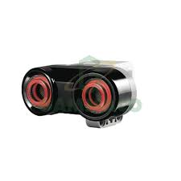
### Overview

The LEGO EV3 Ultrasonic Sensor measures the distance to nearby objects without physical contact by emitting ultrasonic sound waves and measuring the time required for the echo to return.

This sensor is one of the primary components used for wall following and navigation during both competition challenges.

### Operating Principle

The sensor operates using the following process:

1. An ultrasonic pulse is emitted.
2. The sound wave travels through the air.
3. The wave reflects off nearby objects.
4. The reflected signal returns to the sensor.
5. The EV3 calculates the distance using the measured travel time.

### Features

- Measurement range: **3–250 cm**
- Contact-free distance measurement
- Fast real-time updates
- Wide detection angle
- Fully compatible with LEGO EV3

### Typical Applications

- Wall following
- Obstacle detection
- Distance measurement
- Autonomous navigation

### Advantages

- Reliable distance measurements
- Easy to integrate and program
- Operates in both bright and dark environments
- Independent of ambient lighting

### Why We Use It

The ultrasonic sensor continuously measures the robot's distance from the surrounding walls, allowing precise wall-following and stable navigation throughout the course.

---

## Why We Combine the Compass and Ultrasonic Sensors

Neither sensor is sufficient on its own for reliable navigation.

### Using Only the Ultrasonic Sensor

Although the ultrasonic sensor accurately measures the distance to nearby walls, it provides no information about the robot's orientation. Additionally, ultrasonic readings may occasionally fluctuate due to reflections, angled surfaces, or environmental noise.

### Using Only the Compass Sensor

The compass accurately measures the robot's heading but cannot determine its position relative to the walls. As a result, the robot could maintain the correct heading while gradually drifting away from the desired path.

### Our Solution

We combine both sensors to take advantage of their complementary strengths.

- The **compass** maintains the robot's heading.
- The **ultrasonic sensor** maintains a constant distance from the wall.

This sensor fusion approach provides significantly more stable navigation than either sensor could achieve independently. Throughout testing, it greatly improved wall-following accuracy and reduced cumulative positioning errors.

---

# Robot

# Robot Mechanical Design

## Rear Wheel Drive Mechanism

Our robot uses a rear-wheel differential drive system powered by a single EV3 Medium Motor.

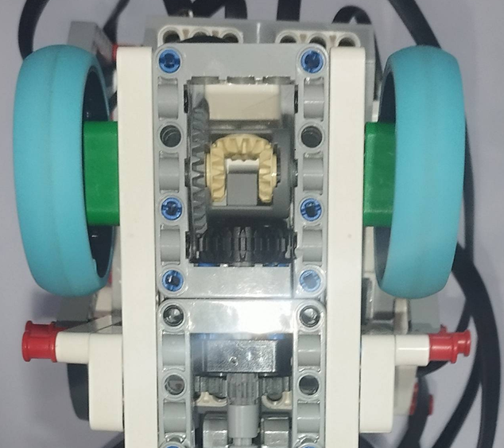

The differential is connected through a **24:8 gear ratio**, increasing the rotational speed by a factor of three before transferring power to the rear wheels.

This configuration allows the robot to achieve higher speeds while maintaining sufficient torque for acceleration.

### Why We Chose the Medium Motor

A common question is why we selected the EV3 Medium Motor instead of the Large Motor.

#### Comparison

| EV3 Medium Motor | EV3 Large Motor |
|------------------|-----------------|
| Higher speed | Higher torque |
| Smaller size | Larger size |
| Better for lightweight robots | Better for heavy-duty applications |

### Speed

Speed is a critical factor in both the Open Challenge and the Obstacle Challenge.

Although the Large Motor produces greater torque, it rotates more slowly. The Medium Motor's higher rotational speed, combined with our gear ratio, enables the robot to complete the Open Challenge in approximately **36–40 seconds** during testing.

### Compact Design

The Medium Motor is significantly smaller than the Large Motor, allowing us to keep the robot within the WRO size constraints while simplifying the drivetrain layout.

---

## Steering Mechanism

Our steering system uses a simple but reliable gear reduction mechanism.

The steering motor drives a **16-tooth gear**, which meshes with a **64-tooth gear** attached to the steering linkage.

This reduction provides:

- Increased steering precision
- Greater steering torque
- Smooth and repeatable steering movements

The simplicity of this mechanism also improves reliability and makes maintenance easier during competitions.

---

## Mobility Management

Our robot's mobility system was designed to maximize speed while maintaining precise and stable navigation. Throughout development, we focused on three key engineering objectives:

- Optimizing drivetrain efficiency
- Improving steering precision
- Increasing overall chassis stability

### 1. Drivetrain Optimization

Early testing showed that extremely aggressive gear ratios produced high theoretical speeds but poor acceleration. The motors frequently stalled during starts and after sharp turns.

After testing multiple gear ratios, we selected the configuration that provided the best compromise between acceleration, torque, and maximum speed.

This optimization resulted in:

- Faster acceleration
- More consistent lap times
- Reduced motor stress
- Improved controller stability

### 2. Steering Precision

Our first steering design used a rack-and-pinion mechanism.

Although compact, testing revealed excessive backlash, causing steering inaccuracies and oscillations during high-speed driving.

To solve this issue, we redesigned the steering linkage with a custom mechanism that significantly reduced mechanical play.

As a result, we achieved:

- More accurate steering angles
- Better return-to-center performance
- Reduced overshoot
- Smoother obstacle avoidance

### 3. Chassis Stability

Maintaining a low center of gravity was one of our primary design goals.

The EV3 Brick and battery pack were mounted as low as possible to reduce body roll during cornering.

Heavy components were also positioned close to the center of the chassis, reducing rotational inertia and allowing the robot to change direction more quickly.

Finally, the chassis was reinforced using cross-bracing to minimize structural flex and maintain consistent wheel alignment throughout each run.
***
# Robot Software Aspect

## Development Platform

The entire software for our robot was developed using the **LEGO Mindstorms EV3 Programming Environment**.

This platform allowed us to rapidly prototype, test, and debug our algorithms while taking full advantage of the EV3 hardware and third-party sensors.

Throughout development, our primary focus was reliability, modularity, and ease of debugging. Instead of creating one large program, we divided the software into independent modules, making it easier to improve individual components without affecting the rest of the system.

*(Insert screenshots of the programming environment here.)*

---

## Libraries

All custom libraries used throughout this project are included in the repository.

These libraries simplify sensor communication, motor control, and reusable algorithms, making the overall software easier to maintain and expand.

---

# Code Explanation

## Open Challenge

The Open Challenge software is divided into three major components:

1. Setup
2. Servo System
3. Open Challenge Management

Separating the code into modules makes the program easier to understand, debug, and modify throughout development.

---

# 1. Setup

Before every run, the robot performs an automatic steering calibration.

The steering motor first rotates completely to the right and then completely to the left. By measuring the total rotation between these two limits, the program calculates the exact center position.

The calculated midpoint is then stored as the steering center, ensuring that the wheels are perfectly aligned before the robot starts driving.

This calibration process compensates for mechanical tolerances and eliminates the need for manual steering adjustment before every run.

---

# 2. Servo System

The Servo module is the core of our robot's motion control system.

It continuously manages both:

- Vehicle speed
- Steering angle

These two control loops operate simultaneously throughout the robot's run, allowing smooth and responsive driving.

---

## Rear Wheel Control

This block controls the driving motor connected to the rear differential.

The program receives a desired power value and multiplies it by **-1** before sending it to Motor D.

The negative multiplier is necessary because of the physical orientation of our drivetrain during construction. Rather than redesigning the gearbox, we compensated for the reversed motor direction in software.

This approach simplified the mechanical design without affecting overall performance.

---

## Steering Control

Unlike a simple steering system that directly sets a motor position, our robot uses a **PD (Proportional-Derivative) Controller** to achieve smooth and accurate steering.

The controller continuously calculates the steering error between the desired steering angle and the current wheel position.

It then applies proportional and derivative corrections to smoothly move the steering motor toward the target position.

Using a PD controller provides several advantages:

- Smooth steering motion
- Reduced oscillations
- Faster response
- Improved steering accuracy
- Better stability at high speeds

---

## Complete Servo Module

The rear-wheel controller and steering controller operate simultaneously within the Servo module.

Together they function as the robot's low-level motion controller, continuously receiving commands from the navigation system and converting them into precise motor movements.

Every higher-level navigation routine communicates with the robot exclusively through this module.

---

# 3. Open Challenge Management

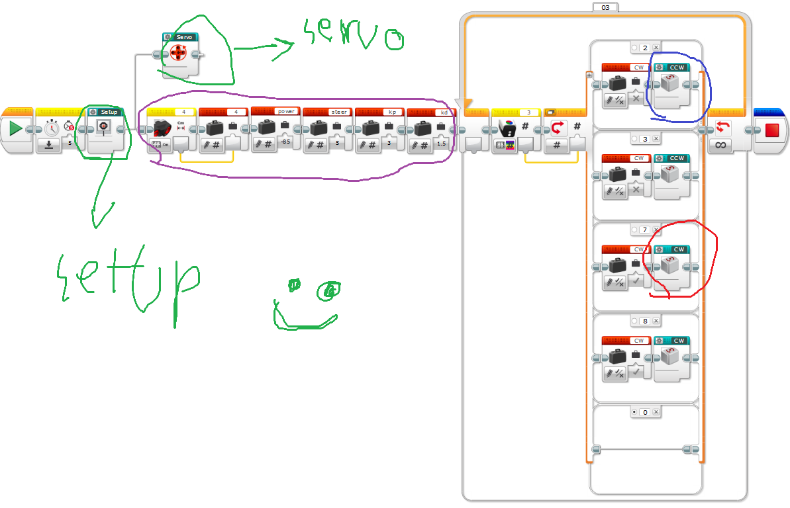

The Open Challenge Management module is responsible for coordinating the robot's behavior throughout the entire autonomous run.

Rather than directly controlling the motors, this module decides:

- Which driving routine should execute
- When the robot should turn
- Which wall to follow
- How steering corrections should be calculated
- When to transition between different stages of the course

---

## Initialization

The variables highlighted at the beginning of the program initialize the robot's operating parameters.

These include:

- **Kp** – Proportional gain
- **Kd** – Derivative gain
- **Distance** – Current ultrasonic sensor reading
- **Power** – Driving speed
- **Steer** – Desired steering angle

These variables are continuously updated while the robot is running.

---

# Clockwise (CW) and Counter-Clockwise (CCW) Modes

The competition allows the robot to drive in either clockwise or counter-clockwise directions.

To simplify the software, we created two independent navigation blocks:

- **CW** (Clockwise)
- **CCW** (Counter-Clockwise)

Although both blocks perform similar tasks, they use opposite steering corrections and wall-following logic depending on the driving direction.

This modular approach significantly simplified debugging and tuning.

---

# CCW Block

Each navigation block consists of two major stages.

---

## Stage 1 – Positioning the Ultrasonic Sensor

The first section rotates the ultrasonic sensor toward the outer wall of the track.

Since the outside wall remains constant throughout the course, using it as the reference wall provides much more stable wall-following than tracking the inside wall.

Maintaining a consistent reference significantly improves navigation accuracy.

---

## Stage 2 – Steering Decision

The next section continuously measures the distance between the robot and the wall.

Based on the measured distance, the program calculates the appropriate steering correction using conditional logic.

This allows the robot to smoothly return to the desired path whenever it moves too close to or too far from the wall.

---

## Stage 3 – Motor Command

The final section sends commands to the Servo module.

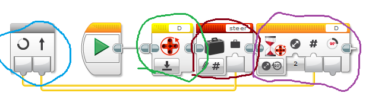

Its main inputs are:

- Steering value
- Motor reset signal
- Target travel distance

The robot continues driving until the required motor rotation has been completed before executing the next instruction.

Separating steering calculations from motor execution improves code readability and makes the software easier to debug.

---

# Stage 2 of the CCW Block

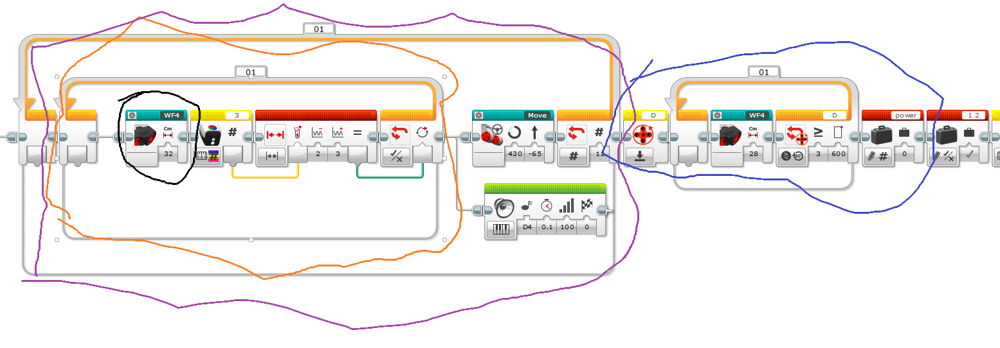

After completing the initial positioning stage, the robot enters the main navigation loop.

This loop executes **11 times**, allowing the robot to complete the required number of laps.

The first quarter-turn is completed before entering the loop, which is why only eleven additional iterations are required instead of twelve.

---

## Wall Following

The orange section performs continuous wall following.

A dedicated **PD controller** calculates steering corrections based on the measured distance from the wall.

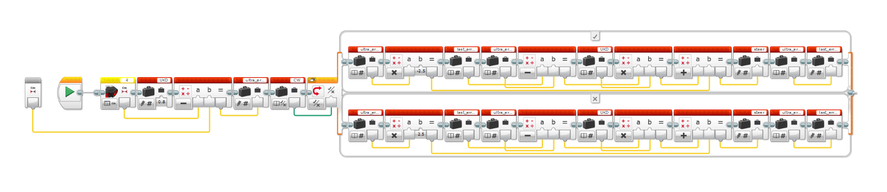

The same control algorithm is used in both CW and CCW modes.

The only difference is the sign of the proportional and derivative gains, which is reversed depending on the driving direction.

This allows the same controller to function correctly regardless of whether the robot is moving clockwise or counter-clockwise.

---

## Line Detection

While following the wall, the robot continuously monitors the color sensor.

When the blue line is detected, the current loop terminates and the robot immediately transitions to the next navigation sequence.

This event marks the completion of one section of the track and initiates the following maneuver.

By combining wall following, compass feedback, and color detection, the robot is able to navigate the Open Challenge with consistent speed and high reliability.
***
- all the code for CCW is the same for CW but with diffrant steering values and kp/kd

## Obstacle Challenge Code

The obstacle challenge code is divided into seven main sections. Separating the program into independent modules makes the code easier to understand, debug, and improve. Each section is responsible for a specific task during the robot's autonomous run.

### 1. Setup
  the setup is the same as the setup in the open challenge
  - [Setup](#1-setup)

---

### 2. Servo
  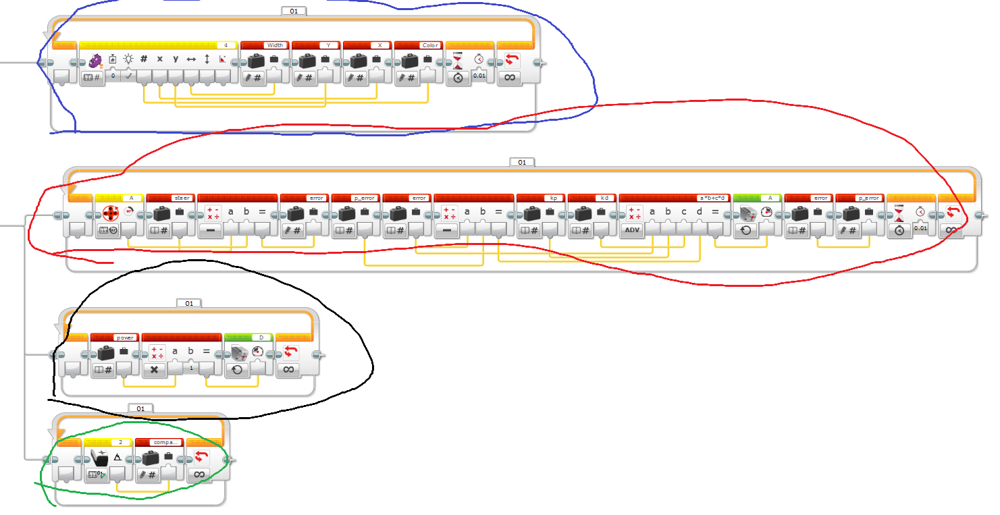
  - The part circled in blue :
  this is the part that reads the color , X and Y cordinates,and width of the obstacle
  as u can see it gives the information to multiple variables like X,Y,width,color
  - The part in red is basically a steering PD like the one in the OPEN challenge
  - The part in black is the speeding and power system just like the one in the open challenge
  - The part in green mesuares the absloute value of the compass sensor and stores it into a variable
  - note this that all the parts here run in an endless loop and make a servo

---

### 3. Getting Out of the Parking Zone

well our ultrasonic spins to the left and checks if its less than or more than 15cm , if its less than 15
cm it knows its in CW and if more than 15 its CCW
if its CW it scans for any obstacle near it and it makes a desicion based on that
if CCW it performs a movement and then starts obstacle tracking
---

### 4. Deciding the Compass Numbers
  before starting the challenge the robot needs to know where it is and what rout to check , in the parking part it figures out if its CW or CCW
  after that the robot reads the compass numbers and checks what range is it in and then continues the rout

---

### 5. CCW and CW Blocks
  both are the same logically but the only diffrence is the constant multipliers and steering values
  
  so each block is mainly 3 parts
  - part1 : loop stopper
    
    this part breaks anyloop when the color sensor detects a line
  - part2 :  obstacle managment
    so for following the green obstacles we use this PD formula where
    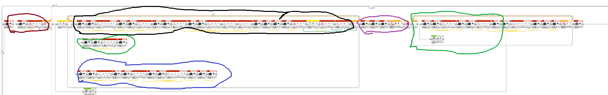
    the black circle is the PD formula for follwing the obstacle and i explained our strategy in the next part
    
    the blue circle is the PD algorithm for the compasss sensor

    and the green part is where we take both of the PD algorithm and merge them together and giving the final value to the steering value

    and when the camera detects no obstacles withing the width range we have chosen it goes on wall following mode

---

### 6. Obstacle Management Strategy
  so heres our strategy for managing the obstacles 
  - Red obstacle :
    
    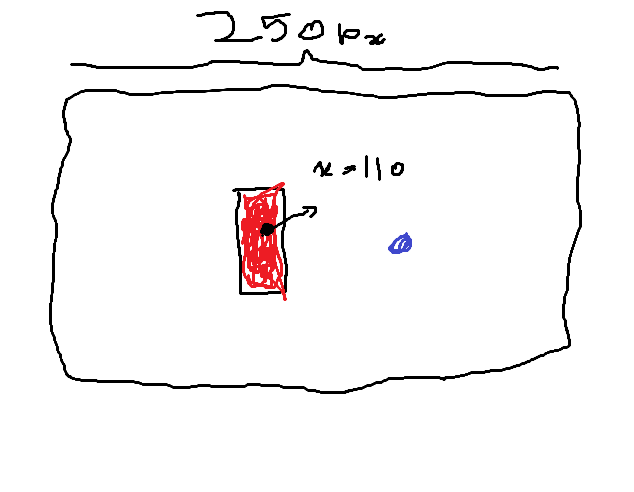

    so our over all strategy is to follow an imaginary point but we hit a problem that we want the imaginary point to move depending on the X value of the obstacle so we came up with a strategy
    so in the picture we want to follow the purple point what we do is track the X value of the obstacle , in the picture its 110 for example we first divide the 110 by 2 to get the center of the obstacle and then add 60 to it and the rquation looks like this : 60+(1/2), and we give it to a PD algorithm and merge it with a PD algorithhm for the compass sensor and give it to the steering value in the servo
  - Green obstacle :
    
    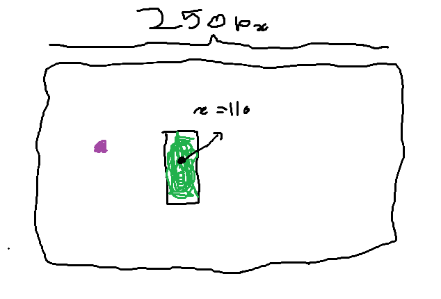

    the general strategy is the same for the green obstacle but instead of taking the X value and adding into it we first take the X value and divide by 2 to get the center of the obstacle and subtracting that value from 250 and the equation for it looks like this : 250-(x/2), then we give it to a PD algorithm and again merge it with a PD compass algorithm and give the final value to the steering value in the servo
and thats how we handle the obstacles
---

### 7. Getting Into the Parking Zone

*Write your explanation here.*

